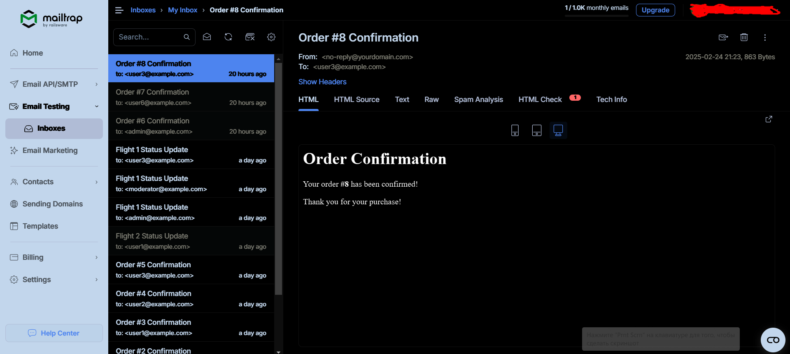

# Library Service

Clone repo and install requirements:
````bash
  git clone https://github.com/MindDevastation/library-service-project.git
````
Change brunch to `develop`

Change folder to src:
````bash
  cd src
````

Run:

````bash
  pip install -r requirements.txt
````

## Add auto code styling

Run:

```bash
  pre-commit install
```

It will run `black` every time you make a commit

Also you can 
- Open `File` → `Settings` → `Tools` → `Black`
- Check the `Enable Black`
- Go to `File` → `Settings` → `Editor` → `Editor` → `Code Style` → `Python` and 
make sure that `Formatter` is set to `Black`

Now black will format the code when you press `Ctrl + Alt + L`.

## Project structure

<pre>
library-service-project/
├── src/
│   ├── library/       # Main project (settings, routes)
│   ├── users/         # User management application
│   ├── books/         # Book management application
│   ├── borrowings/    # Booking management application
│   ├── payments/      # Payment application
│   ├── logs/          # System Logs
│   ├── templates/     # Email templates (e.g., return reminders)
│   ├── library_db_data.json  # Initial data (optional)
│   └── manage.py
├── requirements.txt   # Dependencies
├── Dockerfile         # Containerization
├── docker-compose.yml # Конфигурация Docker
├── .env               # Environment variables
├── .gitignore         # Ignored files
├── README.md          # Documentation
└── .pre-commit-config.yaml  # Pre-commit hooks
</pre>

| Микросервис на диаграмме | 	Соответствие в Django монолите |
|--------------------------|---------------------------------|
| 📖 Books Service         | 	books (Django app)             |
| 📌 Borrowing Service     | 	borrowings (Django app)        |
| 👥 Customers Service     | 	users (Django app)             |
| 👀 View Service          | 	DRF Browsable API (auto UI)    |
| 💰 Payment Service       | 	payments (Django app)          |
| 📢 Notifications Service | 	Celery + Django Signals        |

## Users (Arseniy)

- Email -> unique -> login
- First name
- Last name
- Password
- Is staff

## Borrowing (Taras)

- Borrow date
- Expected Return date
- Actual Return date
- Book id -> Books 1-1
- User id -> Users 1-1

## Payment (Nick)

- Status
- Type
- Borrowing id -> Borrowing
- Session url
- Session id
- Money to pay

## Books (Oleksandr)

- Title
- Pages
- Authors
- Cover
- Inventory
- Daily fee
- Quantity

## Telegram bot (Alex)

## Mailing (Ruslan)


## Email Setup Guide (Using MailTrap)

This project supports email notifications. For testing purposes, MailTrap is used to simulate email sending.

#### Step 1: Create a MailTrap Account

1. Go to MailTrap and sign up.

2. Create a new inbox and navigate to its SMTP settings.

3. Note down the SMTP credentials (host, port, username, password).

#### Step 2: Configure Django Settings

Update your settings.py file with the following configuration:

```ini
EMAIL_BACKEND = "django.core.mail.backends.smtp.EmailBackend"
EMAIL_HOST = "smtp.mailtrap.io"  # Use the host from your MailTrap account
EMAIL_PORT = 2525  # The recommended port
EMAIL_HOST_USER = "your_mailtrap_username"  # Your MailTrap username
EMAIL_HOST_PASSWORD = "your_mailtrap_password"  # Your MailTrap password
EMAIL_USE_TLS = True
EMAIL_USE_SSL = False
DEFAULT_FROM_EMAIL = "noreply@example.com"
```

#### Step 3: Sending a Test Email

You can send a test email using Django’s built-in send_mail function:

```python
from django.core.mail import send_mail

send_mail(
    "Test Email",
    "This is a test email sent via MailTrap.",
    "noreply@example.com",
    ["recipient@example.com"],
    fail_silently=False,
)
```

#### Step 4: Verifying the Email

1. Go back to your MailTrap inbox.

2. Check if the test email appears in the list.

Now your project is set up for email notifications using MailTrap! 🎉

**Example:**



## Setting Up Payments with PayPal and Stripe (Test Mode)

This guide will help you configure test payments using PayPal and Stripe in the project.

### 1. Setting Up PayPal (Sandbox Mode)

To integrate PayPal in test mode, follow these steps:

1. **Create a PayPal Developer Account**  
   - Go to [PayPal Developer Dashboard](https://developer.paypal.com/) and log in.
   - Navigate to **"Dashboard" → "My Apps & Credentials"**.
   - Under **Sandbox**, create a new app and get the **Client ID** and **Secret**.

2. **Configure PayPal in Django**  
   Add the following environment variables in your `.env` file:

```ini
   PAYPAL_MODE=sandbox  # Use "live" for production
   PAYPAL_CLIENT_ID=your_paypal_client_id
   PAYPAL_SECRET=your_paypal_secret
```

3. **Install PayPal SDK**
Ensure the SDK is installed in your environment:

```sh
   pip install paypalrestsdk
```

4. **Add PayPal Configuration in Django**
In your Django settings (settings.py):

```python
import paypalrestsdk

PAYPAL_MODE = os.getenv("PAYPAL_MODE", "sandbox")
PAYPAL_CLIENT_ID = os.getenv("PAYPAL_CLIENT_ID")
PAYPAL_SECRET = os.getenv("PAYPAL_SECRET")

paypalrestsdk.configure({
    "mode": PAYPAL_MODE,
    "client_id": PAYPAL_CLIENT_ID,
    "client_secret": PAYPAL_SECRET
})
```

5. **Test PayPal Payments**

- Use sandbox test accounts from the PayPal Developer Dashboard.
- Initiate a test payment using the API and verify transactions in the Sandbox Transactions section.

### 2. Setting Up Stripe (Test Mode)
To integrate Stripe for test payments:

1. **Create a Stripe Account**

- Go to Stripe Dashboard and log in.
- Navigate to "Developers" → "API Keys".
- Copy the Publishable Key and Secret Key.
2. **Configure Stripe in Django**

Add these environment variables in your .env file:

```ini
STRIPE_SECRET_KEY=your_stripe_secret_key
STRIPE_PUBLIC_KEY=your_stripe_public_key
```

3. **Install Stripe SDK**

Ensure you have the Stripe package installed:

```sh
  pip install stripe
```
4. **Add Stripe Configuration in Django**

In your Django settings (settings.py):
```python
import stripe

STRIPE_SECRET_KEY = os.getenv("STRIPE_SECRET_KEY")
STRIPE_PUBLIC_KEY = os.getenv("STRIPE_PUBLIC_KEY")

stripe.api_key = STRIPE_SECRET_KEY
```