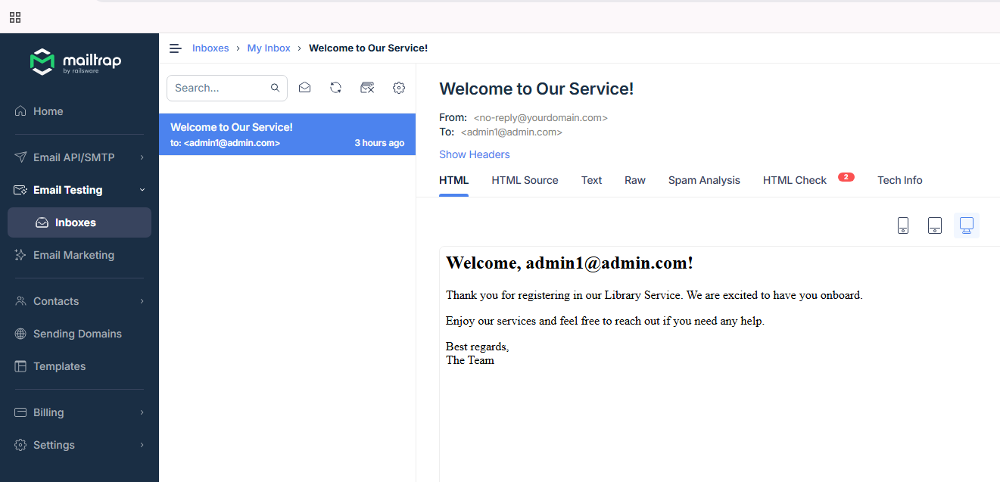

# Library Service

Clone repo and install requirements:
````bash
  git clone https://github.com/MindDevastation/library-service-project.git
````
Change brunch to `develop`

Change folder to src:
````bash
  cd src
````

Run:

````bash
  pip install -r requirements.txt
````

## Add auto code styling

Run:

```bash
  pre-commit install
```

Run:
````bash
   pip install djangorestframework-simplejwt
````

It will run `black` every time you make a commit

Also you can 
- Open `File` → `Settings` → `Tools` → `Black`
- Check the `Enable Black`
- Go to `File` → `Settings` → `Editor` → `Editor` → `Code Style` → `Python` and 
make sure that `Formatter` is set to `Black`

Now black will format the code when you press `Ctrl + Alt + L`.

## Project structure

<pre>
library-service-project/
├── scripts/              # Script folder
│   ├── backend_start.sh  # Script to run Django backend
│   ├── worker_start.sh   # A script to run Celery worker
│   ├── celery_beat_start.sh  # Скрипт для запуска Celery Beat
│   └── bot_start.sh      # Скрипт для запуска Telegram-бота
├── docker/                            # Docker configuration
│   ├── api/                           # Docker for API
│   │   ├── Dockerfile                 # Dockerfile for API
│   ├── bot/                           # Docker for Telegram bot
│   │   ├── Dockerfile                 # Dockerfile for bot
├── requirements.txt                  # Project dependencies
├── docker-compose.yml                # Docker Compose configuration
├── .env                               # Environment variables
├── .env.sample                        # Example .env file
├── .gitignore                         # Git ignore file
├── README.md                          # Project documentation
├── .dockerignore                      # Docker ignore file
├── .pre-commit-config.yaml            # Pre-commit hooks configuration
├── src/                               # Source code of the application
│   ├── library/                       # Main project
│   │   ├── __init__.py                # Makes the folder a Python package
│   │   ├── asgi.py                    # ASGI configuration
│   │   ├── celery.py                  # Celery configuration
│   │   ├── settings.py                # Project settings
│   │   ├── urls.py                    # Main project routes
│   │   ├── wsgi.py                    # WSGI configuration
│   ├── users/                         # User management application
│   │   ├── migrations/                # User migrations
│   │   ├── __init__.py                # Makes the folder a Python package
│   │   ├── admin.py                   # Admin panel for users
│   │   ├── apps.py                    # User application configuration
│   │   ├── models.py                  # User models
│   │   ├── serializers.py             # User serializers
│   │   ├── tests.py                   # Tests for user application
│   │   ├── urls.py                    # User API routes
│   │   ├── views.py                   # User API views
│   ├── books/                         # Book management application
│   │   ├── migrations/                # Book migrations
│   │   ├── __init__.py                # Makes the folder a Python package
│   │   ├── admin.py                   # Admin panel for books
│   │   ├── apps.py                    # Book application configuration
│   │   ├── models.py                  # Book models
│   │   ├── serializers.py             # Book serializers
│   │   ├── tasks.py                   # Celery tasks for books
│   │   ├── tests.py                   # Tests for book application
│   │   ├── urls.py                    # Book API routes
│   │   ├── views.py                   # Book API views
│   ├── borrowings/                    # Booking management application
│   │   ├── migrations/                # Booking migrations
│   │   ├── admin.py                   # Admin panel for bookings
│   │   ├── apps.py                    # Booking application configuration
│   │   ├── models.py                  # Booking models
│   │   ├── permissions.py             # Booking permissions
│   │   ├── schema.py                  # Booking schema
│   │   ├── serializers.py             # Booking serializers
│   │   ├── signals.py                 # Booking signals
│   │   ├── tasks.py                   # Celery tasks for bookings
│   │   ├── tests.py                   # Tests for booking application
│   │   ├── urls.py                    # Booking API routes
│   │   ├── validators.py              # Booking validation
│   │   ├── views.py                   # Booking API views
│   ├── payments/                      # Payment application
│   │   ├── migrations/                # Payment migrations
│   │   ├── __init__.py                # Makes the folder a Python package
│   │   ├── admin.py                   # Admin panel for payments
│   │   ├── apps.py                    # Payment application configuration
│   │   ├── helpers.py                 # Payment helper functions
│   │   ├── models.py                  # Payment models
│   │   ├── serializers.py             # Payment serializers
│   │   ├── tests.py                   # Tests for payment application
│   │   ├── urls.py                    # Payment API routes
│   │   ├── views.py                   # Payment API views
│   ├── logging_app/                   # Logging application
│   │   ├── migrations/                # Logging migrations
│   │   ├── __init__.py                # Makes the folder a Python package
│   │   ├── admin.py                   # Admin panel for logs
│   │   ├── apps.py                    # Logging application configuration
│   │   ├── middleware.py              # Logging middleware
│   │   ├── models.py                  # Logging models
│   │   ├── signals.py                 # Logging signals
│   │   ├── utils.py                   # Logging utilities
│   │   ├── views.py                   # Logging API views
│   ├── logs/                          # Log files
│   │   ├── actions.log                # User action logs
│   │   ├── borrowing_payment_actions.log # Borrowing payment action logs
│   │   ├── errors.log                 # Error logs
│   ├── templates/                     # Email templates
│   │   ├── borrowing_confirmation_email.html # Template for borrowing confirmation
│   │   ├── borrowing_status_update_email.html # Template for status update on borrowing
│   │   ├── registration_success_email.html # Template for successful registration
│   ├── telegram_bot/                  # Telegram bot
│   │   ├── __init__.py                # Makes the folder a Python package
│   │   ├── config.py                  # Bot configuration (token, API URL)
│   │   ├── main.py                    # Main script to run the bot
│   │   ├── activity.py                # User activity logging
│   │   ├── handlers/                  # Command handlers for the bot
│   │   │   ├── start.py               # /start command handler
│   │   │   ├── auth.py                # Authorization command handler
│   │   │   ├── books.py               # Book interaction handler
│   │   │   ├── borrowing.py           # Borrowing command handler
│   │   │   ├── help.py                # /help command handler
│   │   │   ├── me.py                  # User info handler
│   │   │   ├── stop.py                # /stop command handler
│   │   ├── middlewares/               # Middleware for handling requests
│   │   ├── keyboards/                 # Custom keyboards for bot interactions
│   │   ├── services/                  # API services for interacting with the backend
│   │   │   ├── auth.py                # Authentication API
│   │   │   ├── books.py               # Books API
│   │   │   ├── borrowing.py           # Borrowing API
│   │   │   ├── bot.py                 # Bot-related functions
│   │   │   ├── db.py                  # Database interaction functions
│   │   │   ├── me.py                  # User info API
│   │   ├── media/                     # Media files (images, videos)
│   │   ├── utils/                     # Utility functions for the bot
│   ├── manage.py                      # Project management script
│   └── library_db_data.json           # Initial database data
</pre>

| Микросервис на диаграмме | 	Соответствие в Django монолите |
|--------------------------|---------------------------------|
| 📖 Books Service         | 	books (Django app)             |
| 📌 Borrowing Service     | 	borrowings (Django app)        |
| 👥 Customers Service     | 	users (Django app)             |
| 👀 View Service          | 	DRF Browsable API (auto UI)    |
| 💰 Payment Service       | 	payments (Django app)          |
| 📢 Notifications Service | 	Celery + Django Signals        |

## Users (Arseniy)

- Email -> unique -> login
- First name
- Last name
- Password
- Is staff

# Borrowing Service

The borrowing service allows users to temporarily borrow books and track their return. The functionality includes creating borrowing records, checking book availability, tracking return status, limiting active borrowings, and verifying outstanding debts. Additionally, the system automatically updates the status of overdue borrowings and sends notifications.

## Main Model: Borrowing

The `Borrowing` model represents a record of a user borrowing a book and contains the following key fields:

- `borrow_date` – the date of borrowing (automatically set when the record is created).
- `expected_return_date` – the expected return date.
- `actual_return_date` – the actual return date (can be empty until the book is returned).
- `status` – the status of the borrowing ("pending", "returned", "overdue").
- `book` – the book that was borrowed.
- `user` – the user who borrowed the book.

### Status Update Logic

- When a book is returned, the status changes to `returned`, and if the actual return date is not set, it is assigned the current date.
- If the expected return date has passed and the book has not been returned, the status automatically changes to `overdue`.

## Data Validation

The system applies multiple levels of data validation before saving a borrowing record:

1. **Inventory Check** – Prevents borrowing if the book is not available in stock.
2. **Return Date Validation** – Ensures that the return date is not set in the past or beyond the maximum allowed period (30 days).
3. **Unique Borrowing Restriction** – A user cannot borrow the same book again while it is still in their possession.
4. **Borrowing Limit** – A user cannot have more than 5 active borrowings at the same time.

## Access Restrictions

To ensure security and control over borrowings, the following access levels are implemented:

- Users can only view their own borrowings.
- Administrators have access to all borrowing records.
- A new borrowing request cannot be created if the user has outstanding payments.

## Process Automation

- **Overdue Borrowing Check**: Performed as a background task (using Celery). All borrowings past their return deadline are updated to `overdue` status.
- **Notifications**: If there are overdue borrowings, the system sends a message via Telegram.

## Borrowing Endpoints

#### **GET /api/borrowings/** (List all borrowings with filtering)
- **Headers:**
  ```json
  {
    "Authorization": "Bearer jwt-token-here"
  }
  ```
- **Query Parameters:**
  - `is_active=true/false` (Filters active borrowings)
  - `user_id={id}` (Admins can filter by user ID)
- **Response:**
  ```json
  [
    {
      "id": 1,
      "user_email": "user1@example.com",
      "book_title": "The Catcher in the Rye",
      "book_authors": [
        {
          "id": 3,
          "name": "J.D. Salinger"
        }
      ],
      "borrow_date": "2025-03-10",
      "expected_return_date": "2025-03-25",
      "status": "pending"
    },
    {
      "id": 2,
      "user_email": "user2@example.com",
      "book_title": "1984",
      "book_authors": [
        {
          "id": 2,
          "name": "George Orwell"
        }
      ],
      "borrow_date": "2025-02-15",
      "expected_return_date": "2025-03-01",
      "status": "overdue"
    }
  ]
  ```

#### **GET /api/borrowings/{id}/** (Retrieve a single borrowing record)
- **Headers:**
  ```json
  {
    "Authorization": "Bearer jwt-token-here"
  }
  ```
- **Response:**
  ```json
  {
    "id": 1,
    "user_email": "user1@example.com",
    "book": {
      "title": "The Catcher in the Rye",
      "authors": [
        {
          "id": 1,
          "name": "J.D. Salinger"
        }
      ],
      "inventory": 3,
      "description": "two days in the life of 16-year-old Holden Caulfield after he has been expelled from prep school"
    },
    "borrow_date": "2025-03-10",
    "expected_return_date": "2025-03-25",
    "actual_return_date": null,
    "status": "pending"
  }
  ```

#### **POST /api/borrowings/** (Create a new borrowing record)
- **Headers:**
  ```json
  {
    "Authorization": "Bearer jwt-token-here"
  }
  ```
- **Request Body:**
  ```json
  {
    "book": 1,
    "expected_return_date": "2025-03-25"
  }
  ```
- **Response:**
  ```json
  {
    "id": 3,
    "book": 1,
    "expected_return_date": "2025-03-25",
    "status": "pending"
  }
  ```

#### **POST /api/borrowings/{id}/return/** (Return a borrowed book)
- **Headers:**
  ```json
  {
    "Authorization": "Bearer jwt-token-here"
  }
  ```
- **Request Body:**
  ```json
  {
    "provider": "Stripe",
    "currency": "USD"
  }
  ```
- **Response:**
  ```json
  {
    "message": "Borrowing returned successfully",
    "go_to_pay": "https://payment-provider.com/pay"
  }
  ```
## Payments and Financial Restrictions

Before creating a new borrowing record, the system verifies whether the user has outstanding payments. If there are unpaid transactions via Stripe or PayPal, borrowing is blocked until the payments are settled.

## Payments overview

This project integrates payment processing using PayPal and Stripe. Below is a detailed guide on how to set up and use these payment gateways in test mode.

### Payment Integration:

- Implemented payment processing using Stripe and PayPal.
- Added utility functions for creating payment records in the database.
- Integrated choice fields for selecting payment providers.
- Implemented APIs for returning books with payment handling.

### Utility Functions:

- create_stripe_payment: Creates a Stripe payment instance and returns the payment and checkout session.
- create_paypal_payment: Creates a PayPal payment instance and returns the payment and approval URL.
- calculate_payment: Calculates the total amount to be paid and determines the payment type based on the borrowing record.
- process_payment: Processes the payment based on the specified provider and returns the URL for payment.

### Including:

- Added an endpoint to handle the return of borrowed books, which includes payment processing.
- Provided serializers for handling provider selection.

## Setting Up Payments with PayPal and Stripe (Test Mode)

This guide will help you configure test payments using PayPal and Stripe in the project.

### 1. Setting Up PayPal (Sandbox Mode)

To integrate PayPal in test mode, follow these steps:

1. **Create a PayPal Developer Account**  
   - Go to [PayPal Developer Dashboard](https://developer.paypal.com/) and log in.
   - Navigate to **"Dashboard" → "My Apps & Credentials"**.
   - Under **Sandbox**, create a new app and get the **Client ID** and **Secret**.

2. **Configure PayPal in Django**  
   Add the following environment variables in your `.env` file:

```ini
   PAYPAL_MODE=sandbox  # Use "live" for production
   PAYPAL_CLIENT_ID=your_paypal_client_id
   PAYPAL_SECRET=your_paypal_secret
```

3. **Install PayPal SDK**
Ensure the SDK is installed in your environment:

```sh
   pip install paypalrestsdk
```

4. **Add PayPal Configuration in Django**
In your Django settings (settings.py):

```python
import paypalrestsdk

PAYPAL_MODE = os.getenv("PAYPAL_MODE", "sandbox")
PAYPAL_CLIENT_ID = os.getenv("PAYPAL_CLIENT_ID")
PAYPAL_SECRET = os.getenv("PAYPAL_SECRET")

paypalrestsdk.configure({
    "mode": PAYPAL_MODE,
    "client_id": PAYPAL_CLIENT_ID,
    "client_secret": PAYPAL_SECRET
})
```

5. **Test PayPal Payments**

- Use sandbox test accounts from the PayPal Developer Dashboard.
- Initiate a test payment using the API and verify transactions in the Sandbox Transactions section.

### For logging into PayPal when you go to the approval link, use these credentials:

- Email: sb-7crpl38155236@personal.example.com
- Password: r/3TI90b

### 2. Setting Up Stripe (Test Mode)
To integrate Stripe for test payments:

1. **Create a Stripe Account**

- Go to Stripe Dashboard and log in.
- Navigate to "Developers" → "API Keys".
- Copy the Publishable Key and Secret Key.
2. **Configure Stripe in Django**

Add these environment variables in your .env file:

```ini
STRIPE_SECRET_KEY=your_stripe_secret_key
STRIPE_PUBLIC_KEY=your_stripe_public_key
```

3. **Install Stripe SDK**

Ensure you have the Stripe package installed:

```sh
  pip install stripe
```
4. **Add Stripe Configuration in Django**

In your Django settings (settings.py):
```python
import stripe

STRIPE_SECRET_KEY = os.getenv("STRIPE_SECRET_KEY")
STRIPE_PUBLIC_KEY = os.getenv("STRIPE_PUBLIC_KEY")

stripe.api_key = STRIPE_SECRET_KEY
```
### Use the following card data for test payments:

- Visa: 4242424242424242, CVV: Any 3 digits, Expiry: Any future date
- Mastercard: 5555555555554444, CVV: Any 3 digits, Expiry: Any future date

## Books (Oleksandr)

- Title
- Pages
- Authors
- Cover
- Inventory
- Daily fee
- Quantity

## Telegram bot (Alex)

## Mailing (Ruslan)


## Email Setup Guide (Using MailTrap)

This project supports email notifications. For testing purposes, MailTrap is used to simulate email sending.

#### Step 1: Create a MailTrap Account

1. Go to MailTrap and sign up.

2. Create a new inbox and navigate to its SMTP settings.

3. Note down the SMTP credentials (host, port, username, password).

#### Step 2: Configure Django Settings

Update your settings.py file with the following configuration:

```ini
EMAIL_BACKEND = "django.core.mail.backends.smtp.EmailBackend"
EMAIL_HOST = "smtp.mailtrap.io"  # Use the host from your MailTrap account
EMAIL_PORT = 2525  # The recommended port
EMAIL_HOST_USER = "your_mailtrap_username"  # Your MailTrap username
EMAIL_HOST_PASSWORD = "your_mailtrap_password"  # Your MailTrap password
EMAIL_USE_TLS = True
EMAIL_USE_SSL = False
DEFAULT_FROM_EMAIL = "noreply@example.com"
```

#### Step 3: Sending a Test Email

You can send a test email using Django’s built-in send_mail function:

```python
from django.core.mail import send_mail

send_mail(
    "Test Email",
    "This is a test email sent via MailTrap.",
    "noreply@example.com",
    ["recipient@example.com"],
    fail_silently=False,
)
```

#### Step 4: Verifying the Email

1. Go back to your MailTrap inbox.

2. Check if the test email appears in the list.

Now your project is set up for email notifications using MailTrap! 🎉

**Example:**



If you don't want to create MailTrap account, you can use following credentials in settings.py:

```ini
EMAIL_HOST_USER="63300fac82c4e7"
EMAIL_HOST_PASSWORD="cff332583ed0a1"
```

Or you can setup console email backend in settings.py:

```ini
EMAIL_BACKEND = "django.core.mail.backends.console.EmailBackend"
```


## Logging System

This project implements a logging system to track user actions and system errors.
It helps with debugging, monitoring user activity, and maintaining data integrity.

### 1. User Action Logging

User actions such as creating, updating, and deleting records are automatically logged in the database.
This is done via Django signals, ensuring that all changes are recorded without modifying the main business logic.

Creating, updating, and deleting Book, Borrowing, and Payment records.

### 2. Error Logging

All application errors are logged using Python's built-in logging module.
This helps in diagnosing issues without exposing sensitive error messages to users.

Logs are stored in the database and in a file (logs/errors.log).

### 3. How to View Logs?

#### User Action Logs:

Run the following query in Django shell:

```python
from logging_app.models import ActionLog
ActionLog.objects.all()
```

Or check action logs in file:

`logs/actions.log`

#### Error Logs:

Run the following query in Django shell:

```python
from logging_app.models import ErrorLog
ErrorLog.objects.all()
```

Or check error logs in file:

`logs/errors.log`

## Telegram bot

## Bot structure:

<pre>
│   ├── telegram_bot/       # Telegram bot
│   │   ├── __init__.py
│   │   ├── config.py       # Configuration (bot token, API URL)
│   │   ├── main.py         # Starting the bot
│   │   ├── activity.py     # Activity logging
│   │   ├── handlers/       # Command handlers
│   │   │   ├── start.py    # /start command handler
│   │   │   ├── auth.py     # User authorization handler
│   │   │   ├── books.py    # Book management handler
│   │   │   ├── borrowing.py # Booking handler
│   │   │   ├── help.py     # Help command handler
│   │   │   ├── me.py       # User info handler
│   │   │   ├── stop.py     # Stop handler
│   │   ├── middlewares/    # Middleware (if any)
│   │   ├── keyboards/      # Custom keyboards for user interactions
│   │   ├── services/       # API requests (auth, books, borrowing)
│   │   │   ├── __init__.py
│   │   │   ├── auth.py     # Auth API
│   │   │   ├── books.py    # Books API
│   │   │   ├── borrowing.py # Borrowing API
│   │   │   ├── bot.py      # Bot-related functions
│   │   │   ├── db.py       # Database interaction functions
│   │   │   ├── me.py       # User info API
│   │   ├── media/          # Media files (images, videos)
│   │   └── utils/          # Utility functions
</pre>

### Info

You can use different approaches in Telegram bots depending on 
the requirements of the project and the libraries used. Here are the main ones:

### 1. Using `aiogram` (Asynchronous approach)
- Main idea: aiogram is an asynchronous library for building Telegram bots that uses asyncio for interacting with the Telegram API. It allows handling requests and commands concurrently, improving performance.
- Best for: Projects where high performance is important, with a large number of users and asynchronous interaction with external services (e.g., databases or APIs).
- Advantages:
- - Support for asynchronous operations.
- - Easy webhook handling.
- - Fast message and command processing.
- Example: Suitable for complex bots that need to handle many requests simultaneously and interact efficiently with network resources.
### 2. Using `python-telegram-bot` (Synchronous approach)
- Main idea: This is a more traditional synchronous library for building Telegram bots. It's easy to use but less efficient for high-traffic bots.
- Best for: Smaller projects or when high performance is not critical.
- Advantages:
- - Simple to use.
- - Well-documented and maintained.
- Disadvantages: Can cause delays when scaling due to its synchronous nature.
### 3. Using `telebot` (Synchronous approach)
- Main idea: telebot is another synchronous library that is simple and popular among beginners. It is suitable for creating bots with basic functionality.
- Best for: Simple bots with few commands and no need for asynchronous interaction with other services.
- Advantages:
- - Easy to set up and use.
- - Ideal for small projects.
- - Disadvantages: Limited functionality compared to more powerful libraries like aiogram.
### 4. Webhooks vs. Polling
- Polling: In polling, the bot periodically checks the Telegram server to receive new messages. This is a simple approach but may cause additional load.

- - Advantages: Easy to set up and suitable for small projects.
- - Disadvantages: Lower performance compared to webhooks.
- Webhooks: With webhooks, Telegram server sends notifications to a specified URL when new messages are received. This is a more efficient approach for high-traffic bots.

- - Advantages: Less load on the server, faster response to events.
- - Disadvantages: Requires setting up a server to handle incoming requests.
### 5. Microservice Architecture
- Main idea: Create a Telegram bot as a microservice that interacts with other services via APIs. Each component, such as user authentication, payments, books, etc., could be a separate microservice.
- Best for: Large projects that require dividing logic into independent components that can be scaled and developed separately.
- Advantages:
- - Easier to maintain and extend.
- - Responsibility is divided among different parts of the system.
- Disadvantages: Requires more resources for development and maintenance.
### 6. Using Databases and Caching
- Main idea: For bots with complex logic and state storage (e.g., user data or progress tracking), databases and caching mechanisms are used for efficient data storage and retrieval.
- Best for: Projects where data needs to be stored across sessions or when tracking user state.
- Example: Using Redis or a database (e.g., PostgreSQL) for data caching and user state management.

In this project we are using `aiogram` library

### What is `aiogram`

`aiogram` is an asynchronous Python library for building Telegram bots using the asyncio framework. It is designed to handle a large number of requests efficiently by enabling concurrent operations. It provides a simple, easy-to-use interface for interacting with the Telegram Bot API.

### Key Features:
- Asynchronous: Built on top of asyncio, allowing you to handle multiple requests concurrently without blocking the event loop.
- Fast: Because of its async nature, it is highly scalable and handles high loads effectively.
- Simple API: It provides a straightforward way to interact with Telegram, including handling messages, commands, inline queries, and custom keyboards.
- Webhooks Support: Supports both long polling and webhooks, enabling efficient handling of incoming updates.
- Comprehensive: Includes utilities for managing states, middlewares, and error handling.
### Use Cases:
- Ideal for building complex, high-performance bots that require fast response times and can scale with high traffic.

## *aiogram* vs *Telegram API* vs *Django ORM*

### 1. aiogram
- What it is: aiogram is a Python library specifically designed for building Telegram bots asynchronously using Python's asyncio framework.
- Key features:
- - Handles Telegram Bot API interactions using asyncio, allowing concurrent message handling.
- - Built-in support for commands, messages, inline keyboards, and webhooks.
- - Efficient and scalable, handling multiple updates at once without blocking.
- - Ideal for large-scale bots with high traffic or complex workflows.
- Use case: If you're building a high-performance Telegram bot in Python, aiogram is the go-to choice due to its asynchronous nature, ease of integration with webhooks, and simple API for interacting with Telegram.
### 2. Telegram API
- What it is: The Telegram Bot API is the core API provided by Telegram to interact with their platform, allowing you to send and receive messages, manage bots, and access user data.
- Key features:
- - Provides direct access to Telegram servers.
- - You interact with it using HTTP requests (either via polling or webhooks).
- - It is language-agnostic, meaning you can interact with it using any programming language that supports HTTP requests.
- Use case: The Telegram API is the fundamental protocol that any bot interacts with, but it doesn’t provide higher-level abstractions like aiogram or other libraries. You can directly use the API with libraries like requests or http.client in Python, but this requires more manual work.
### 3. Django ORM
- What it is: Django ORM (Object-Relational Mapping) is a part of the Django web framework used to interact with databases in a Pythonic way. It maps database tables to Python classes, making it easier to query and manipulate data stored in a database.
- Key features:
- - Allows easy interaction with relational databases like PostgreSQL, MySQL, SQLite, etc.
- - Handles database migrations, models, and relationships automatically.
- - Ideal for managing persistent data (e.g., user accounts, messages, logs) in web applications, including bots.
- Use case: Django ORM is not used directly for building Telegram bots. However, if you are building a bot that needs to interact with a database (for example, to store user data, messages, or other persistent information), Django ORM can be a great tool for managing that data.

### Main Commands
#### `/start`

Starts interaction with the bot and provides information about its functionality.

#### `/help`

Displays instructions on how to use the bot.

### Bot Structure
- handlers/ — Directory containing command handlers. Each file in this directory handles a specific command.
- services/ — Directory that contains the logic for interacting with the API for users, books, bookings, and payments.
- keyboards/ — Directory containing custom keyboards for user interactions.
- middlewares/ — Directory for middleware, if needed.
- config.py — Configuration file with bot token and API URL.

### config.py
This file contains essential information to run the bot. Be sure to add your Telegram bot token and API URL here.

```python
TELEGRAM_BOT_TOKEN = "your_telegram_bot_token"
API_URL = "http://your-api-url.com"
```

### Router 

In aiogram, the Router is a feature introduced in version 3.0 that helps 
to manage and organize the routing of updates (messages, commands, events) 
in a Telegram bot. It allows you to easily define handlers for different types 
of updates, such as messages, commands, or even custom events, and organize your 
code more efficiently.

### async

In Python, `async` is a keyword used to define asynchronous functions, 
which allow your program to run code concurrently, without blocking other 
operations. This is particularly useful when dealing with I/O-bound 
tasks such as handling web requests, reading files, or working with APIs 
(like the Telegram Bot API in aiogram).

Here’s a brief breakdown of key concepts related to async and how it works:

#### Key Concepts of async in Python:
1. **`async` Keyword:**

- You use async before a function definition to mark it as asynchronous. An asynchronous function is a coroutine, which means it can pause and resume its execution.
- Example:
```python
async def my_async_function():
    print("This is async!")
```
2. **`await` Keyword:**

- Inside an async function, you can use await to pause the function and wait for a result from another asynchronous operation, like an HTTP request, database query, or a bot update.
- Example:
```python
async def fetch_data():
    result = await some_async_task()  # This pauses until the task completes
    print(result)
```
3. **Event Loop:**

- An event loop is responsible for executing asynchronous code. It runs the asynchronous tasks and ensures that your program doesn't block other tasks while waiting for something to complete (like fetching data from an API).
- Python’s `asyncio` library is used to manage the event loop, and most asynchronous libraries (like aiogram) rely on it.
4. **Concurrency vs. Parallelism:**

- **Concurrency** means that multiple tasks can make progress without waiting for one another. However, they don't necessarily run at the same time. This is the key benefit of using async.
- **Parallelism** involves tasks running at the same time (which typically requires multi-threading or multi-processing). In contrast, async does not use multiple threads, but it allows tasks to pause while waiting for I/O-bound operations, enabling the event loop to run other tasks in the meantime.

## API Documentation for login_telegram_checkout
### Description
This API endpoint allows users to authenticate in the system using their email and password.

### URL
`POST /api/login-telegram-checkout/`

### Request Parameters
The request must contain a JSON object with the following fields:

| Field	 | Type	    | Required	| Description      |
|----------|----------|-----------|------------------|
| email	 | string	| Yes	    | User's email.    |
| password	 | string	| Yes	    | User's password. |
### Example Request
```json
{
  "email": "user@example.com",
  "password": "securepassword123"
}
```
### Responses
**Success (200 OK)**

If the user is successfully authenticated, the server returns:

```json
{
  "detail": "Login successful"
}
```
**Error 400 (Bad Request)**

If the email or password is missing:

```json
{
  "detail": "Email and password are required"
}
```
**Error 401 (Unauthorized)**

If the credentials are incorrect:

```json
{
  "detail": "Invalid credentials"
}
```
### Notes
- Authentication is handled using Django's authenticate function.
- The email field is used as the username in the custom user model.

## API: CRUD for Books

This project provides full CRUD functionality for managing books.  
You can use the following API endpoints:

- **Create a Book** (POST `/api/books/`)
- **Retrieve a Book** (GET `/api/books/{id}/`)
- **Update a Book** (PUT `/api/books/{id}/`)
- **Delete a Book** (DELETE `/api/books/{id}/`)
- **List All Books** (GET `/api/books/`)

Example request to create a book:

```json
{
  "title": "The Great Gatsby",
  "pages": 180,
  "authors": ["F. Scott Fitzgerald"],
  "cover": "https://example.com/gatsby.jpg",
  "inventory": 5,
  "daily_fee": 1.5,
  "quantity": 10
}
```

## Running the Project

### Start Django Server

Run the following command to start the Django development server:

```sh
python src/manage.py runserver
```

The API will be available at `http://127.0.0.1:8000/`.

## Running Celery and Redis

Celery is used for background tasks, and Redis acts as the message broker.

1. **Start Redis** (ensure Redis is installed):
   ```sh
   redis-server
   ```
2. **Start Celery Worker**:
   ```sh
   cd src
   celery -A library worker --loglevel=info
   ```
